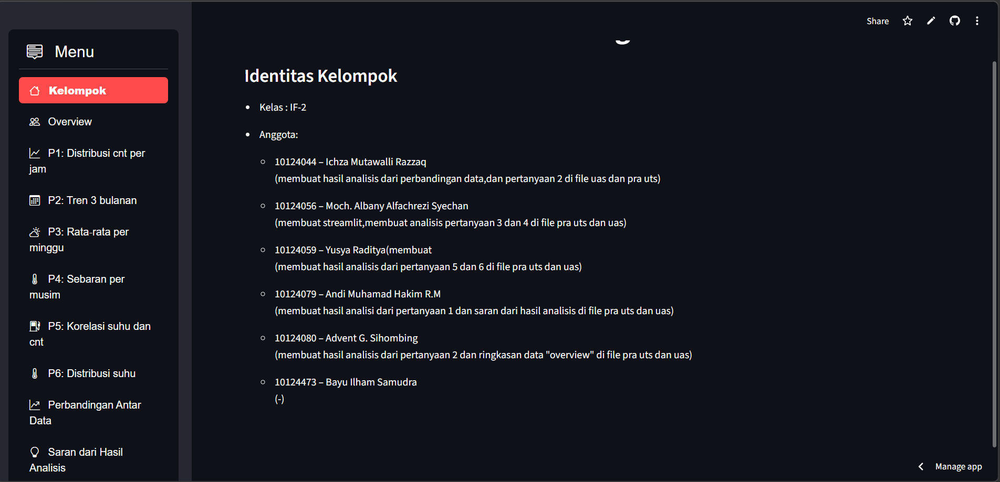

# Bike Sharing Dashboard

Proyek ini merupakan analisis data Bike Sharing Dataset menggunakan Python dan Streamlit. Dashboard ini menjawab beberapa pertanyaan terkait distribusi jumlah penyewa, tren musiman, hubungan suhu dengan penyewaan, serta memberikan saran bisnis berdasarkan hasil analisis.

---

## Identitas Kelompok

- Kelas : IF-2  
- Anggota:
  - 10124044 – Ichza Mutawalli Razzaq  
    (membuat hasil analisis dari perbandingan data, dan pertanyaan 2 di file UAS dan pra UTS)
  - 10124056 – Moch. Albany Alfachrezi Syechan  
    (membuat Streamlit, membuat analisis pertanyaan 3 dan 4 di file pra UTS dan UAS)
  - 10124059 – Yusya Raditya  
    (membuat hasil analisis dari pertanyaan 5 dan 6 di file pra UTS dan UAS)
  - 10124079 – Andi Muhamad Hakim R.M  
    (membuat hasil analisis dari pertanyaan 1 dan saran dari hasil analisis di file pra UTS dan UAS)
  - 10124080 – Advent G. Sihombing  
    (membuat hasil analisis dari pertanyaan 2 dan ringkasan data *overview* di file pra UTS dan UAS)
  - 10124473 – Bayu Ilham Samudra  
    (-)

---

## Tampilan Dashboard

## Link Dashboard

Dashboard dapat diakses melalui:

- Streamlit : https://tugasuasif2s3-qde6chk35q854mbod6p2a5.streamlit.app/

## Penjelasan 
- Youtube : https://youtu.be/N_R8D0tbOv4

---

## Pertanyaan Analisis

1. Distribusi jumlah penyewa (cnt) setiap jam (hour.csv).
2. Tren jumlah penyewa per 3 bulan tahun 2011–2012 (day.csv).
3. Rata‑rata jumlah penyewa per hari dalam seminggu (day.csv).
4. Perbedaan sebaran jumlah penyewa (cnt) berdasarkan **musim** (day.csv).
5. Hubungan suhu (temp) dengan jumlah penyewa (cnt) (day.csv).
6. Distribusi suhu (temp)sepanjang pengamatan (day.csv).

## Tahapan Analisis
Analisis dilakukan melalui beberapa tahapan:  
- Data Understanding & Wrangling (memuat dataset day/hour, pengecekan struktur, dan pembersihan sederhana).
- Exploratory Data Analysis (EDA) untuk menjawab pertanyaan P1–P6.
- Visualization & Explanatory Analysis menggunakan grafik distribusi, tren, sebaran musim, dan korelasi suhu–penyewa.
- Penerapan analisis lanjutan (korelasi, regresi linear multivariabel, dan clustering K-Means pada data per jam).
- Pembuatan Dashboard Interaktif menggunakan Streamlit berbasis hasil EDA dan pemodelan.
bisa dibuka pada file di repository ini
---

## Overview

Pada halaman Overview, dashboard menampilkan:

- Daftar pertanyaan analisis (P1–P6) seperti di atas.
- Ringkasan data:
  - Tabel contoh isi dataset day.csv dan statistik deskriptifnya.
  - Tabel contoh isi dataset hour.csv dan statistik deskriptifnya.

---

## P1 – Distribusi Jumlah Penyewa per Jam

- Visualisasi berupa histogram cnt per jam dari hour.csv.
- Statistik deskriptif cnt per jam ditampilkan dalam bentuk tabel.
- Hasil analisis:
  - Distribusi cnt per jam cenderung miring ke kanan (*right‑skewed*).
  - Banyak jam dengan penyewaan rendah dan hanya sedikit jam dengan penyewaan tinggi.

---

## P2 – Tren Jumlah Penyewa per 3 Bulan (2011–2012)

- Data harian day.csv diagregasi menjadi 4 kuartal:
  - Q1: Jan–Mar
  - Q2: Apr–Jun
  - Q3: Jul–Sep
  - Q4: Okt–Des
- Ditampilkan tabel rata‑rata cnt per kuartal untuk tiap tahun dan grafik garis tren.
- Hasil analisis:
  - Tren meningkat dari awal tahun menuju pertengahan tahun.
  - Puncak terjadi sekitar musim panas/gugur, lalu turun kembali di akhir tahun.

---

## P3 – Rata‑rata Jumlah Penyewa per Hari dalam Seminggu

- Data day.csv digabung per nilai weekday (0–6) dan diberi label:
  - Minggu, Senin, Selasa, Rabu, Kamis, Jumat, Sabtu.
- Ditampilkan tabel rata‑rata cnt per hari dan bar chart.
- Hasil analisis:
  - Hari kerja (Senin–Jumat) cenderung memiliki jumlah penyewa lebih tinggi.
  - Puncak biasanya terjadi pada Kamis/Jumat, sedangkan akhir pekan sedikit menurun.

---

## P4 – Sebaran Jumlah Penyewa Berdasarkan Musim

- Musim:
  - 1: Musim Dingin
  - 2: Musim Semi
  - 3: Musim Panas
  - 4: Musim Gugur
- Ditampilkan boxplot cnt per musim.
- Hasil analisis:
  - Musim dingin: median terendah, permintaan rendah dan konsisten.
  - Musim semi: median menengah dengan variasi lebih tinggi.
  - Musim panas: median tinggi dan banyak outlier di atas.
  - Musim gugur: median tertinggi dan cukup konsisten.

---

## P5 – Korelasi Suhu (temp) dan Jumlah Penyewa (cnt)

- Menghitung koefisien korelasi Pearson antara temp dan cnt.
- Menampilkan scatter plot suhu vs jumlah penyewa.
- Hasil analisis:
  - Ada hubungan positif yang cukup kuat: semakin hangat (hingga titik tertentu), penyewaan meningkat.
  - Pada suhu sangat tinggi, kenaikan jumlah penyewa mulai melandai.

---

## P6 – Distribusi Suhu (temp)

- Menampilkan histogram temp dari day.csv.
- Menampilkan statistik deskriptif temp.
- Hasil analisis:
  - Rentang temp sekitar 0.06 – 0.86 dengan mayoritas pada kisaran menengah 0.3–0.7.
  - Rentang tersebut kira‑kira ekuivalen 12–28°C sehingga cukup nyaman untuk bersepeda.
  - Hampir tidak ada nilai ekstrem mendekati 0 atau 1 (suhu sangat dingin/panas).

---

## Perbandingan Antar Data

Halaman ini terdiri dari tiga tab:

### 1. Heatmap Korelasi (day.csv)

- Menggunakan variabel: temp, atemp, hum, windspeed, casual, registered, cnt.
- Ditampilkan korelasi antar variabel dalam bentuk heatmap.
- Hasil analisis:
  - temp dan atemp sangat berkorelasi (multikolinearitas tinggi).
  - cnt berkorelasi kuat dengan temp dan registered.
  - hum cenderung berkorelasi negatif kecil terhadap cnt.

### 2. Regresi Linear Multivariabel

- Model: cnt ~ temp + workingday + season.
- Ditampilkan koefisien model dan nilai R².
- Hasil analisis:
  - Koefisien temp positif: kenaikan temp menaikkan cnt rata‑rata sesuai koefisien.
  - workingday dan season memberi efek tambahan sesuai konteks hari kerja dan musim.

### 3. K-Means Clustering Jam Penyewaan (hour.csv)

- Fitur yang digunakan: temp, hum, `cnt.
- Data dinormalisasi dengan StandardScaler, lalu dikelompokkan dengan K-Means (3 cluster).
- Ditampilkan scatter 3D serta rata‑rata cnt per cluster.
- Hasil analisis (contoh interpretasi):
  - Cluster 0: jam sibuk dengan cnt tinggi dan suhu nyaman.
  - Cluster 1: jam sepi dengan cnt rendah (malam atau cuaca buruk).
  - Cluster 2: jam menengah (rekreasi/akhir pekan).

---

## Saran dari Hasil Analisis

Beberapa rekomendasi yang diambil dari hasil eksplorasi:

- Saat jam sibuk, sebaiknya menambah unit sepeda; saat hujan atau kondisi sepi dapat dipertimbangkan pemberian diskon untuk menarik pengguna.
- Pada musim panas dan gugur, unit dapat diperbanyak dan diperluas ke area pusat kota karena permintaan tinggi dan banyak hari libur.
- Musim dingin yang cenderung sepi dapat dimanfaatkan untuk perawatan unit sepeda agar siap digunakan pada musim dengan permintaan tinggi.

---

## Teknologi yang Digunakan

- Python  
- Pandas  
- NumPy  
- Matplotlib  
- Seaborn  
- Scikit-learn  
- Plotly Express  
- Streamlit  
- streamlit-option-menu

---
## Struktur Repository

- Dashboard.png  
  Screenshot tampilan dashboard Streamlit.
  
- README.md  
  Dokumentasi proyek (deskripsi, tahapan analisis, cara menjalankan, dll.).
  
- Tugas1_Bike Sharing Dataset_IF-2_10124056-checkpoint.ipynb  
  Notebook analisis data Bike Sharing (EDA dan perhitungan).
  
- UAS.py 
  Script utama Streamlit untuk menjalankan dashboard.

- day.csv  
  Dataset harian (day-level) Bike Sharing.

- hour.csv  
  Dataset per jam (hour-level) Bike Sharing.

- requirements.txt  
  Daftar library Python yang dibutuhkan untuk menjalankan notebook dan dashboard.
---

